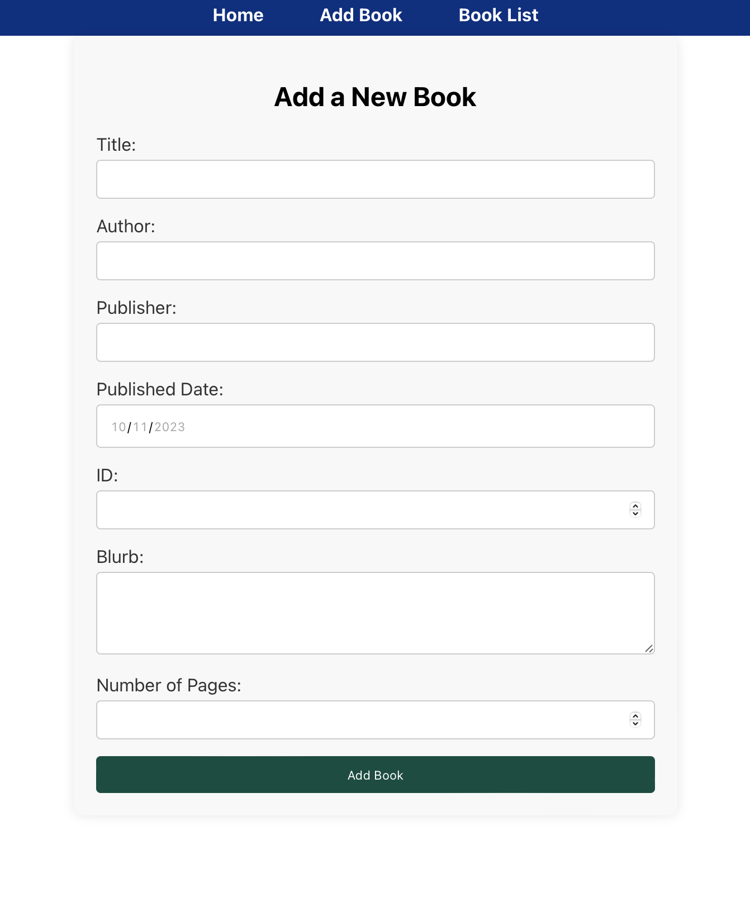
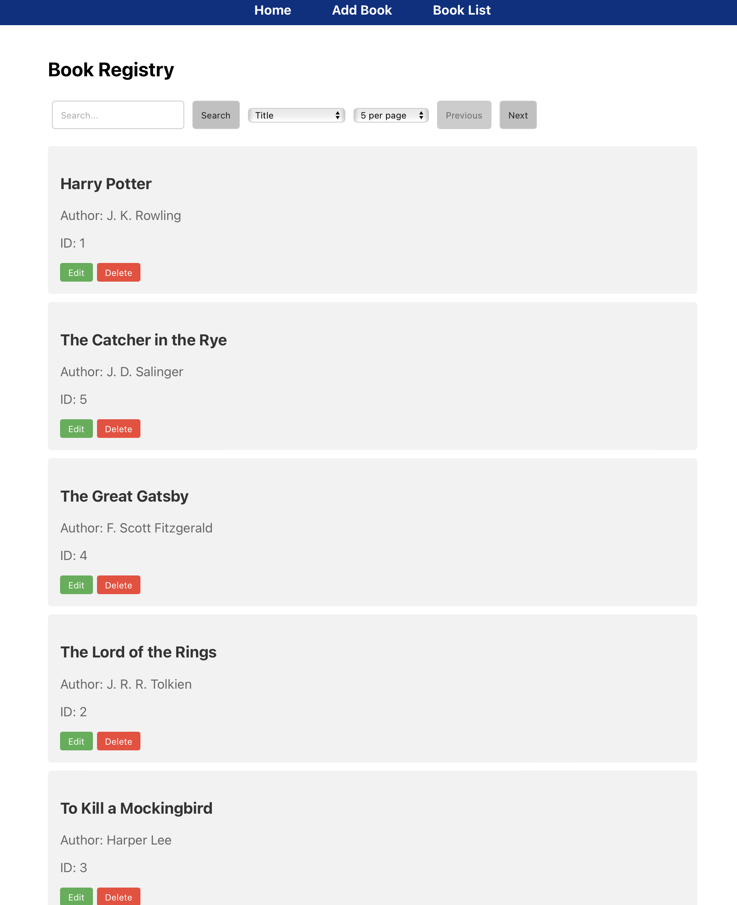

# Cordel City Council Library Management System

## Overview

The Library Management System is a full-stack application designed to facilitate the management of a library's book inventory. The application is split into two main parts: the backend, which is built using .NET and the frontend, which is built using React.

## Features

- **Book Management**: Add, edit, and delete books in the library.
- **Search Functionality**: Search through the book list using specific search terms.
- **Sorting**: Sort books by title in ascending or descending order.
- **Pagination**: Browse books in a paginated view.
- **Edit Book Details**: Each book's details can be edited, including the title, author, publisher, published date, a blurb about the book, and the number of pages.

   

## Main Purpose

The main purpose of this system is to provide a user-friendly interface for librarians or administrators to maintain their book inventory, ensuring the library's catalog is up-to-date and easily accessible.

## Getting Started

To get the application up and running on your local machine, follow these steps:

### Prerequisites

Before you begin, ensure you have the following installed:
- [.NET SDK](https://dotnet.microsoft.com/download)
- [Node.js and npm](https://nodejs.org/en/download/) (npm comes with Node.js)

### Running the Backend

1. Navigate to the `Library` folder which contains the .NET backend project.
2. Run the following command to start the backend server:  
`dotnet run`  

This will start the .NET backend on `http://localhost:5082`.

### Running the Frontend

1. Navigate to the `library-react` folder which contains the React frontend project.
2. Install all required npm packages using:
`npm install`
3. Start the frontend application by running:  
`npm start`

This will start the React application and should automatically open `http://localhost:3000` in your web browser.

## Usage

Once both the backend and frontend are running, you can use the web application to manage your library's books. The user interface is intuitive — simply follow the on-screen options to interact with the system.

## Additional Notes

- The backend and frontend are configured to work together out of the box; no additional configuration should be necessary.
- Ensure that your backend service is running before starting the frontend to avoid any connection issues.
- This application was designed as a learning task, to familiarise myself with .NET and ReactJS.

